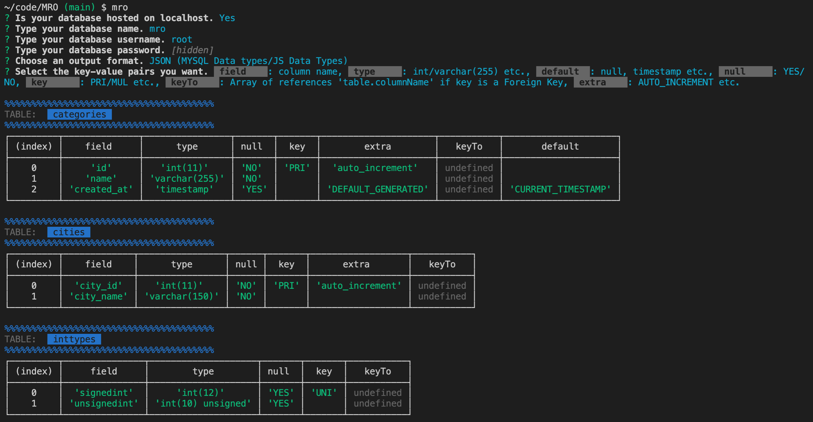

# MRO

**M**odel **R**elations to **O**bjects

###### ORM but in reverse

Reads the schema of relational databases and outputs files in JSON or Javascript format. 

## Why

- You want to quickly generate an overview of your database. 

- You want to backup your database schema and version them.

- You prefer to define your database with SQL syntax. 

- You already have an existing database and don't want to spend additional time remodelling it in your ORM.

- If you aren't sure how to define migrations on certain column types in Knex.js

- If you aren't sure how to model your objects in Objection.js.

- Why not just try it for fun. It's really easy to use. 

## How to use

`npx mro`

And follow the prompts. Should be pretty straightforward. If something isn't then create an issue. 

Just run it where you want the file(s) to be output to. 

#### Supported formats

JSON:

[Check out the JSON example output file](/examples/jsonschema.json)

Knex.js [Unsupported / Experimental / Not tested]: 

[Check out the Knex migration example output file](/examples/20210809039554_mro_migration.js)

http://knexjs.org/#Migrations-API

Objection.js [Unsupported / Experimental / Not tested]: 

[Check out the Objection examples models folder](/examples/objection_models)

https://vincit.github.io/objection.js/guide/models.html#examples

#### Todo

Knex: Figure out how to write a query for the cascading order. Sort the tables by that order and reverse the sort for rollback. 

Objection: Figure out how to write a query that analyzes the relations in my database and whether it's one-to-many, many-to-many or belongs-to-one and also make it bidirectional in the models.

Test manually. 

Write tests. 

## Create an issue

- If you experience bugs
- If you have feature requests 
- If you have general comments/feedback 

## Supported Databases

- Mysql

## Support for other languages/frameworks

If there is interest this might be done in the future.
